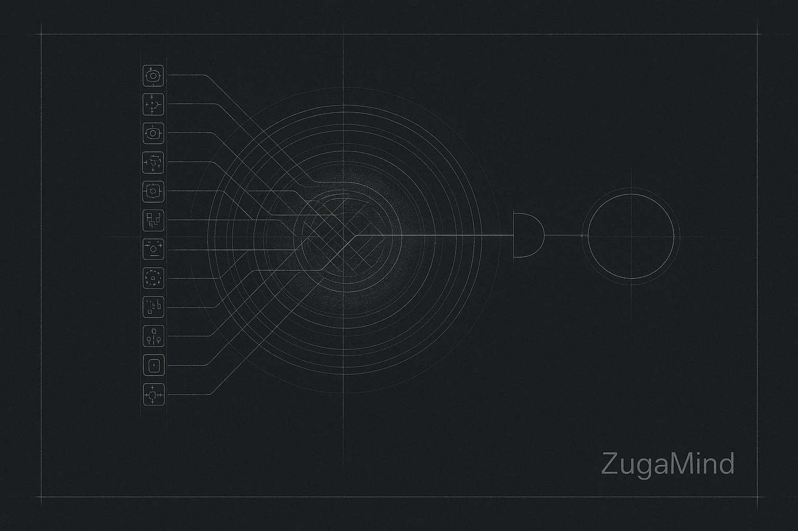
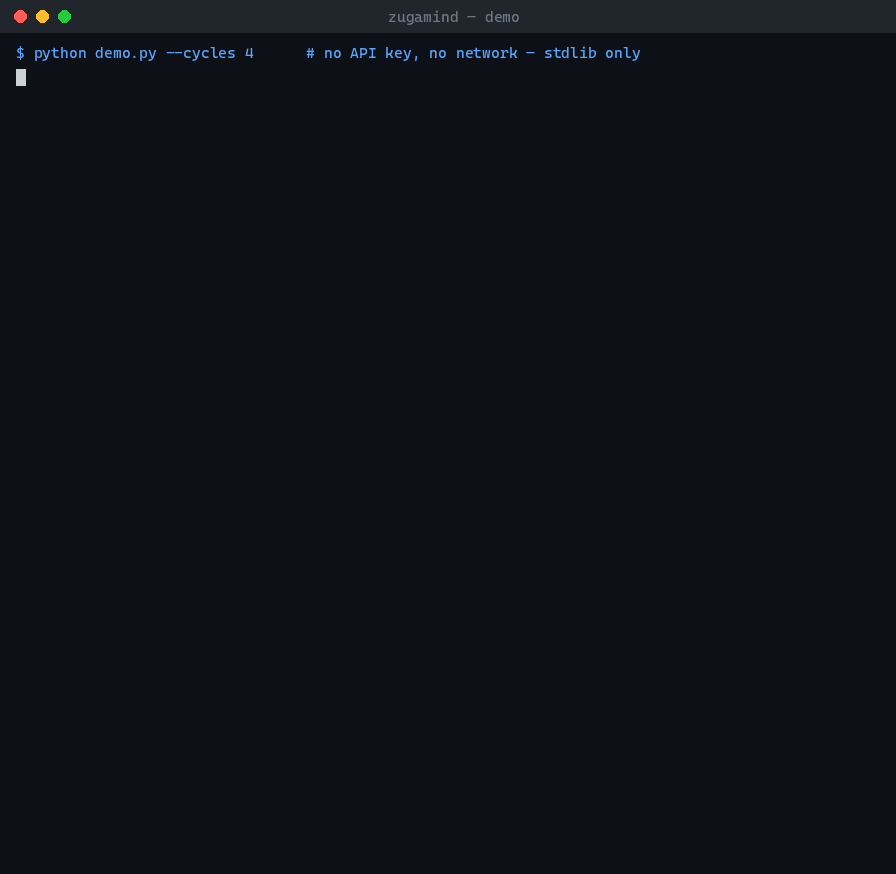

# ZugaMind

[](https://github.com/Zuga-Technologies/zugamind/actions/workflows/ci.yml)
[](LICENSE)
[](pyproject.toml)
[](pyproject.toml)

Your agent harness thinks when you prompt it. ZugaMind thinks the rest of
the time.



ZugaMind is a stdlib-only Global Workspace Theory (GWT) cognitive substrate
that runs as a persistent sidecar next to an agent harness — Claude Code,
OpenClaw, Hermes, Codex CLI, or anything else that runs as a CLI process.
A harness is reactive: it wakes up when you type a prompt, works for one
turn, and forgets everything the moment that turn ends. ZugaMind doesn't.
It runs always-on, perceives the world through scanners, holds continuity
across those wakes in an episodic journal, and — only when something
genuinely wins its attention and clears a fail-closed safety gate — reaches
out and WAKES your harness with a briefing describing what happened and
what to do about it.

Underneath the sidecar behavior is the same explicit, inspectable attention
mechanism this project started as: independent modules submit salience bids
every cycle, an attention schema modulates them for health (no stuck loops,
no starved modules, no monoculture), exactly one winner is selected and
broadcast, and — only when the winner's work genuinely warrants it — the
workspace hands off to Claude through a fail-closed, budget-clamped gate.
Zero pip dependencies in the core package; `pytest` is the only development
dependency.

Built by Zuga Technologies. This is independent research and engineering,
not affiliated with or endorsed by Anthropic. To be precise about what this
is: ZugaMind upgrades the AGENT — giving it persistence, attention, and
proactivity a stateless harness invocation doesn't have on its own — it
never claims to upgrade, replace, or model the underlying LLM itself.

## Why now

On 2026-07-06, Anthropic published ["A global workspace in language
models"](https://transformer-circuits.pub/2026/workspace) describing
evidence that Claude's own internal computation exhibits a global-workspace-like
structure: a limited-capacity bottleneck, broadcast to the rest of the
network, and competition among candidate representations for access to it.
The paper is explicit that **what decides admission to that workspace is
still unknown** — the mechanism is emergent, discovered after the fact by
interpretability tooling, not designed in.

ZugaMind is the engineered complement. It doesn't look inside a model's
activations; it implements the same *pattern* — one bottleneck, one winner
per cycle, broadcast, competition — as an external, steerable substrate that
sits in front of an LLM and decides when that LLM gets invoked at all. Where
Claude's workspace is emergent and hard to steer, ZugaMind's is engineered
and steerable: admission is decided by an explicit salience-bidding
mechanism plus an attention-schema self-model, both fully logged, both
extensible via a plain Python callback (see `register_modulator` below).
The one open question the paper names — "what decides admission" — is the
one thing ZugaMind answers explicitly.

| Paper's GWT observation | ZugaMind's mechanism |
|---|---|
| Limited capacity — one winner per cycle | `Workspace.run_cycle()` selects exactly one `SalienceBid` per cycle |
| Broadcast to the rest of the network | `WorkspaceModule.on_broadcast()` fires on every registered module every cycle |
| Competition for access | Modules submit `SalienceBid`s; `AttentionSchema.modulate()` re-weights them before selection |
| Admission mechanism unknown / not steerable | `AttentionSchema` (streak dampening, diversity cap, blind-spot boost, novelty bonus) + pluggable `register_modulator()` hooks — explicit and inspectable |
| Reportability | `Workspace.get_stats()` returns the full bid field, the winner, and the attention self-model every single cycle |
| Deliberate vs. automatic processing | Cheap/free local-model tier for routine cycles; the fail-closed action gate escalates to Claude only when a winner's work justifies the spend |

## Always-on: the latch-on model

Everything above (the workspace, the attention schema, the action gate)
decides *when something deserves attention*. Three more pieces close the
loop from "decided" to "your harness is now working on it":

- **`continuity/journal.py`** — an episodic, append-only log
  (`data/engine/journal.jsonl`) of every notable cycle event: workspace
  winners, harness invocations, alarms, quiet-hours deferrals, handoffs.
  `build_briefing()` turns the tail of that log into the markdown a waking
  harness reads: current cognitive state, time since the last wake, why
  it's being woken *this* time, what happened since the last wake grouped
  by kind, and anything left unresolved. The briefing is hard-capped (~4000
  chars, `ZUGAMIND_BRIEFING_MAX_CHARS`) and trims its oldest entries first
  when there's too much to say — context assembly is exactly where
  ambient-cognition systems go wrong, drowning the model in noise instead
  of orienting it.
- **`act/command_actuator.py`** — the harness adapter. Given an
  already-approved decision and a briefing, it writes the briefing to a
  temp file, substitutes that path into a configured argv
  (`{briefing_file}`), and runs it as a subprocess — rate-limited per
  harness on both a rolling hour and a rolling day, and never raising (a
  bad command, a timeout, a missing binary all come back as a plain
  `{"ok": False, "error": ...}`, never an exception). It also understands
  an optional quiet-hours window (`ZUGAMIND_QUIET_HOURS`, or a
  `"quiet_hours"` block in the harness config file) that a caller can use
  to suppress wakes overnight.
- **`stream/runner.py`** — the always-on loop:
  `python runner.py --daemon` (from the repo root). Each cycle it sweeps scanners, runs
  one workspace cycle, transitions the cognitive state machine, journals
  what happened — perception and journaling never stop, quiet hours or
  not — and, only if there's a winner AND `gates/action_gate.py` approves
  AND it isn't currently quiet hours, hands the briefing to every enabled,
  configured harness via `command_actuator`. A winner that arrives during
  quiet hours is deferred (journaled, not lost) and surfaces in the
  briefing the next time a real wake happens.

This is the "latch-on": ZugaMind attaches to your harness of choice as a
sidecar process, not a fork or a plugin. Your harness's own code never
changes; it just receives an occasional, well-justified wake-up call with
full context for what to do next.

## Architecture

```
  scanners (perception)
       |
       v
  salience bids  <---- each WorkspaceModule.generate_bid()
       |
       v
  attention schema  ---- streak dampening, diversity cap,
       |                 blind-spot boost, novelty bonus
       v
  ONE winner  (salience**power weighted selection)
       |
       v
  broadcast  ---- every module's on_broadcast() fires
       |
       v
  workspace planner  ---- winner -> a short task plan
       |
       v
  action gate (gates/action_gate.py)  ---- fail-closed, budget-clamped
       |                                    content screen + human veto
       v
  Claude  (or the free local-model tier, if the task doesn't warrant it)
```

Every arrow above is inspectable: `Workspace.get_stats()` after any cycle
returns every bid that competed, the winner, the runner-up, and the
attention schema's current self-model (recent foci, blind spots, whether
it's stuck, attention-switch count).

## Works with your harness

`act/command_actuator.py` loads harness configs from JSON (default
`zugamind/data/harness.json`, overridable via `ZUGAMIND_HARNESS_CONFIG`).
`examples/harness-configs/` ships one ready-to-copy file per harness.

Every row below marked **verified end-to-end** passed the same live test on
2026-07-08 (`scripts/verify_harness.py`, nothing mocked): a canary trigger
won the workspace, cleared the action gate, the actuator spawned the real
harness binary, and the woken agent read ZugaMind's briefing and echoed the
canary token back.

| Harness | Config | Status |
|---|---|---|
| [Claude Code](https://claude.com/claude-code) 2.1.204 | `examples/harness-configs/claude-code.json` | **Verified end-to-end** (Windows) |
| [OpenClaw](https://github.com/openclaw/openclaw) 2026.3.11 | `examples/harness-configs/openclaw.json` | **Verified end-to-end** (macOS) — note the required `--session-id` |
| [Codex CLI](https://github.com/openai/codex) 0.143.0 | `examples/harness-configs/codex.json` | **Verified end-to-end** (macOS) |
| [Hermes Agent](https://github.com/nousresearch/hermes-agent) 0.18.1 | `examples/harness-configs/hermes.json` | **Verified end-to-end** (macOS, local Ollama qwen3:14b — a $0 wake path) |
| Generic webhook | `examples/harness-configs/generic-webhook.json` | Verified as a `curl` shape; supply your own URL |

Run the same proof against your own setup: `python scripts/verify_harness.py`.

Every config is a plain argv list; the literal substring `{briefing_file}`
is replaced with the path to a temp file holding that cycle's markdown
briefing before the command runs. Each config also carries `max_per_hour`
and `max_per_day` rate limits, and **every shipped config is `enabled:
false`** — you flip the flag deliberately after reading what it will run.
See `examples/harness-configs/README.md` for the full shape.

**Prior art & design positioning.** OpenClaw's community proposed a
"Thinking Clock" — a background tick loop with a cheap-LLM tier for idle
perception — in [issue #17287](https://github.com/openclaw/openclaw/issues/17287)
(closed as a duplicate of the same author's broader
["Thinking Agents Manifesto", issue #17363](https://github.com/openclaw/openclaw/issues/17363),
which a maintainer closed as not planned for core: the project's VISION.md
deliberately avoids "shipping heavy orchestration layers as a default
architecture in core", pointing this class of idea at plugins and external
projects instead). ZugaMind is that external layer, built as a
harness-agnostic sidecar instead of a fork of any one harness's core, with
one structural difference: its peripheral tier uses no model at all. Idle
perception is deterministic scanners plus salience competition — free, and
the first model call happens only after something has already won the
workspace and cleared the budget gate, not on every tick.

## Install

**Requirements: Python 3.10+ and git. Nothing else** — the package has zero
dependencies (stdlib only), so there is no install step to run it:

```bash
git clone https://github.com/Zuga-Technologies/zugamind.git
cd zugamind
python demo.py                    # offline demo — no key, no network
python runner.py --once --dry-run # one real perception cycle, no spend
```

Optional editable install (only needed for the test tooling):

```bash
pip install -e ".[dev]"   # the only thing this adds is pytest
pytest -q                 # 262 tests — no network, no keys, ~4s
```

Works identically on Linux, macOS, and Windows (CI runs all three ×
Python 3.10–3.13). On Windows, `python` is whatever your launcher resolves —
`py` works too.

To go from demo to a live sidecar (wire a harness, enable it, run the
daemon), follow the Quickstart below.

## Quickstart

No API key required:

```bash
git clone https://github.com/Zuga-Technologies/zugamind.git
cd zugamind
python demo.py
```



This registers the shipped example modules (`zugamind/cognition/workspace/workspace_modules.py`),
feeds them synthetic scanner triggers for 8 cycles, and prints every bid,
the winner, and the proposed plan per cycle — using only the free local
tier (no network, no key). If `ANTHROPIC_API_KEY` is set in your
environment, the final cycle's winner is additionally routed through the
real action gate to Claude; otherwise that step runs in `dry_run=True` mode
(no network call, no spend) so the whole demo works offline out of the box.

```bash
python demo.py --cycles 20 --seed 3      # more cycles, different synthetic run
```

Then try the always-on runner for one cycle, wired to the shipped Claude
Code harness config, in dry-run mode (no real subprocess call, no spend).
Every config in `examples/harness-configs/` ships `"enabled": false` —
copying a file is never enough to hand an agent a live wake path, so flip
the flag as an explicit act:

```bash
cp examples/harness-configs/claude-code.json zugamind/data/harness.json
# open zugamind/data/harness.json and set "enabled": true
python runner.py --once --dry-run
```

This sweeps the shipped scanners, runs one workspace cycle, and — if a
winner clears the action gate and it isn't currently quiet hours — journals
what *would* have woken Claude Code with the cycle's briefing
(`data/engine/journal.jsonl`), without ever invoking a subprocess. Note
that unlike `demo.py`, this makes real (read-only, unauthenticated) HTTP
requests: the shipped world-scanners poll the HackerNews API and a handful
of public RSS feeds. `--dry-run` means "no harness subprocess, no model
spend" — perception itself is live. Drop
`--dry-run` (and set `ANTHROPIC_API_KEY`) to let it actually run; add
`--daemon [--interval 420]` to run forever instead of one cycle. Before
leaving it running unattended, also set `wake_modules` /
`wake_min_salience` in the config (see
`examples/harness-configs/README.md`) — an unfiltered harness wakes for
*every* gated winner, and read the prompt-injection note in
[Safety design](#safety-design) first.

Run the test suite:

```bash
pip install -e ".[dev]"
pytest
```

## Safety design

ZugaMind assumes an autonomous agent will eventually be wrong, and designs
for that instead of assuming it away:

- **Fail-closed gates.** `gates/action_gate.py` is the single doorway from
  the workspace to Claude. Any missing or erroring check — budget
  resolution, model routing, the content screen — returns `ok=False`.
  Nothing silently proceeds on a gate malfunction.
- **A content screen, not just a spend limit.** Before any paid call,
  `screen_intent()` regex-blocks prompt-injection phrasing, destructive
  shell/SQL commands, forced pushes, secret-exfiltration attempts, and
  attempts to edit the gate's own safety-critical files.
- **A hard budget cap.** `foundation/budget.py` enforces a monthly USD
  ceiling (`ZUGAMIND_MONTHLY_BUDGET_USD`, default $10). The free local-model
  tier is never gated on remaining budget — a budget outage can freeze
  *spend*, never *thinking*. If persisting a spend to the ledger fails
  even after a retry, the gate keeps the already-paid-for response but
  returns `budget_persisted: False` and logs at ERROR — callers and
  monitoring should treat that as "the cap is temporarily unenforceable",
  never ignore it.
- **Everything ships disabled or dry-run.** Every example harness config
  ships `"enabled": false`; the runner has `--dry-run`; wiring a live wake
  path is always an explicit human act, never a side effect of copying a
  file.
- **Know the prompt-injection surface.** The scanners ingest text from the
  open internet (GitHub issue titles, HN/Reddit post titles — anyone can
  write those), and that text flows into the briefing your harness is asked
  to act on. ZugaMind's content screen blocks the clear-cut attack phrasings
  it knows about, but the real defense is the harness's own permission
  model: run wakes through your harness's normal approval prompts (the
  shipped Claude Code config deliberately does NOT pass
  `--dangerously-skip-permissions`), scope `wake_modules` to sources you
  trust, and treat briefing content as untrusted input, because upstream,
  it is.
- **A human veto point.** Any intent can be marked `requires_human: True`;
  the gate refuses to execute it at all. Wiring an actual notification
  (Discord, Slack, email, a ticket) onto that refusal is left to the
  integrator — the core guarantees the refusal, not the paging.
- **Post-hoc integrity checks.** Two are wired into the shipped loop; two
  ship as opt-in library modules for deployments that have the matching
  surface:
  - `gates/work_claim.py` — **wired**: every real (non-dry-run) harness
    reply is checked for accomplishment claims against real git history; a
    claim with no matching commit is journaled as a `work_claim` event
    flagged as confabulation, regardless of how confidently it's phrased.
  - `gates/value_gate.py` — **wired, ships dark**: registered as a bid
    modulator that dampens the salience of bid types that historically
    didn't change real state, plus a post-wake scorer that feeds it. A
    byte-identical no-op until you opt in via
    `ZUGAMIND_VALUE_GATE_ENABLED=true`.
  - `gates/operational_truth.py` — **opt-in library**: a freshness gate
    that re-probes live state before a claim is allowed to surface, so a
    true-once observation can't be re-narrated as still-true indefinitely.
    Populate its service-port map with your deployment's services and
    inject `format_block()` into your briefing/prompt path.
  - `gates/self_mod_cooldown.py` — **opt-in library**: a restart-durable,
    disk-backed cooldown so a self-modification proposal can't thrash the
    same file repeatedly — for integrators whose harness has a
    self-modification lane.
- **Fully logged.** `Workspace.get_stats()`, the attention schema's
  `get_context()`, and every gate's telemetry are structured and
  loggable every cycle — "why did it do that" should always be answerable
  from the log, not from re-running the model.

## Why not just cron?

The reflexive dismissal, answered with the mechanism rather than prose:

| | cron / heartbeat | ZugaMind |
|---|---|---|
| Idle cost | A model call per tick, mattered or not | $0 — deterministic scanners + salience math; the first token billed is after something already won the competition |
| Trigger | The clock | Salience — something changed *and* out-competed everything else this cycle |
| Repeats | Re-alerts on the same thing forever | Habituation — a seen trigger is damped for hours (`ZUGAMIND_HABITUATION_HOURS`) |
| Attention health | N/A | Streak dampening, diversity caps, blind-spot boosts — no source can monopolize wakes |
| Context on wake | Whatever your script passes | A capped continuity briefing: why you're being woken, what happened since last wake, what's unresolved |
| Runaway protection | You write it | Fail-closed gate + hard $ cap + per-hour/per-day invocation caps counted from a durable journal |

If you'd rather read the code as "a priority queue with decay and rate
limits", it works identically under that description — the GWT vocabulary
is the design lineage, not a load-bearing claim.

## Related work

- [Anthropic, "A global workspace in language models"](https://transformer-circuits.pub/2026/workspace)
  (2026-07-06) — interpretability evidence of an emergent internal
  workspace in Claude. ZugaMind is the engineered, external complement at a
  different level of the stack (see [Why now](#why-now) and the limitations
  below — this repo makes no claim about model internals).
- [OpenClaw "Thinking Agents Manifesto" (#17363)](https://github.com/openclaw/openclaw/issues/17363)
  and ["Thinking Clock" (#17287)](https://github.com/openclaw/openclaw/issues/17287) —
  the community design conversation this sidecar answers; see prior-art
  notes above. The manifesto author's own prototype is
  [amor71/thinking-agents](https://github.com/amor71/thinking-agents).
- [giansha/Global-Workspace-Agents](https://github.com/giansha/Global-Workspace-Agents)
  ([arXiv 2604.08206](https://arxiv.org/abs/2604.08206)) — an academic GWT
  multi-agent framework; research-oriented rather than a harness sidecar.
- [bwcummings1/limen](https://github.com/bwcummings1/limen) — a
  self-contained stdlib GWT runtime demo that appeared after the Anthropic
  paper. Different gap: LIMEN demonstrates the loop; ZugaMind ships the
  loop with verified harness adapters, budget/rate-limit safety, and a
  continuity journal for unattended operation.

## Limitations

- This is a **macro-scale task workspace** — an external orchestration
  layer that decides what an agent attends to and when it escalates to an
  LLM. It is **not** a claim about, model of, or replacement for the
  internal, emergent workspace Anthropic's interpretability research
  describes inside the model's own computation. The paper mapping above is
  an analogy at the pattern level, not an implementation of the same
  mechanism.
- The example modules in `cognition/workspace/workspace_modules.py` and the
  four world-scanners in `scanners/world/` are illustrative, not a
  production perception stack. Replace them with your own. The Reddit
  scanner in particular rides unauthenticated public RSS — best-effort by
  design; it may be rate-limited or blocked without notice and fails silent
  to an empty list.
- The budget model (`foundation/budget.py`) is a simple standalone monthly
  cap by design — it is not a multi-agent fleet-wide accounting system.
  Integrators running several agents against a shared budget should supply
  their own `monthly_cap()`.
- `gates/action_gate.py`'s content screen is a regex-based acute safety net,
  not a general-purpose alignment solution — it catches clear-cut,
  named failure classes, not everything that could go wrong. It is one
  layer; your harness's permission model is the load-bearing one (see the
  prompt-injection note under Safety design).
- `gates/work_claim.py`'s entity-grounding check is weaker on Windows: it
  uses the POSIX system dictionary (`/usr/share/dict/words`) to filter
  ordinary capitalized words, which doesn't exist on Windows, so only the
  curated stoplist applies there. Documented in the module; fail-open
  either way.

## License

Apache 2.0 — see `LICENSE` and `NOTICE`. The Apache License does not grant
trademark rights (§6): "ZugaMind" and "Zuga Technologies" are trade names of
Zuga Technologies LLC — fork the code freely, but ship your fork under your
own name.
